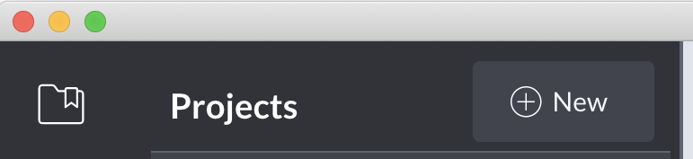
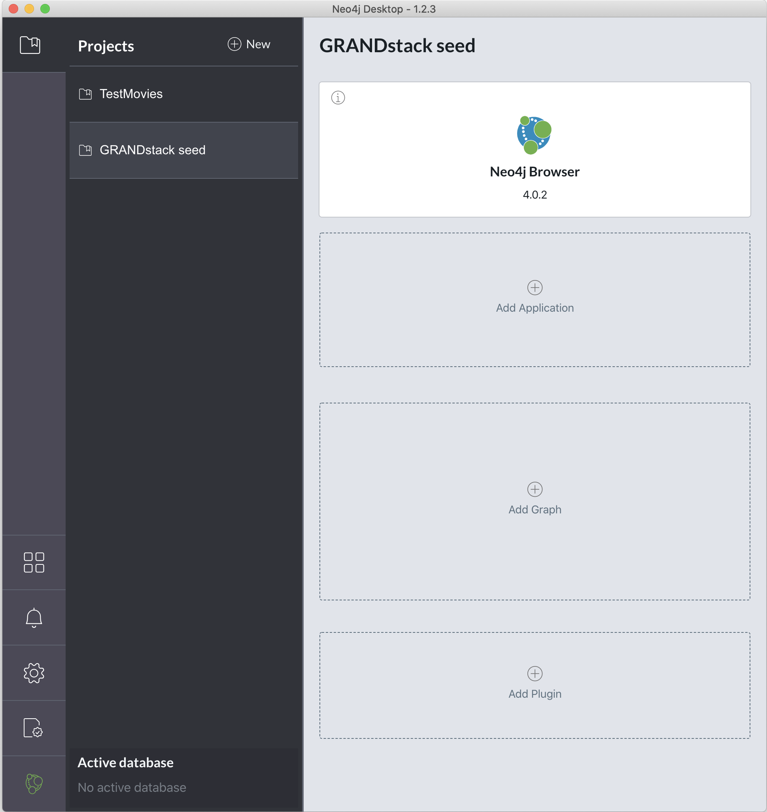
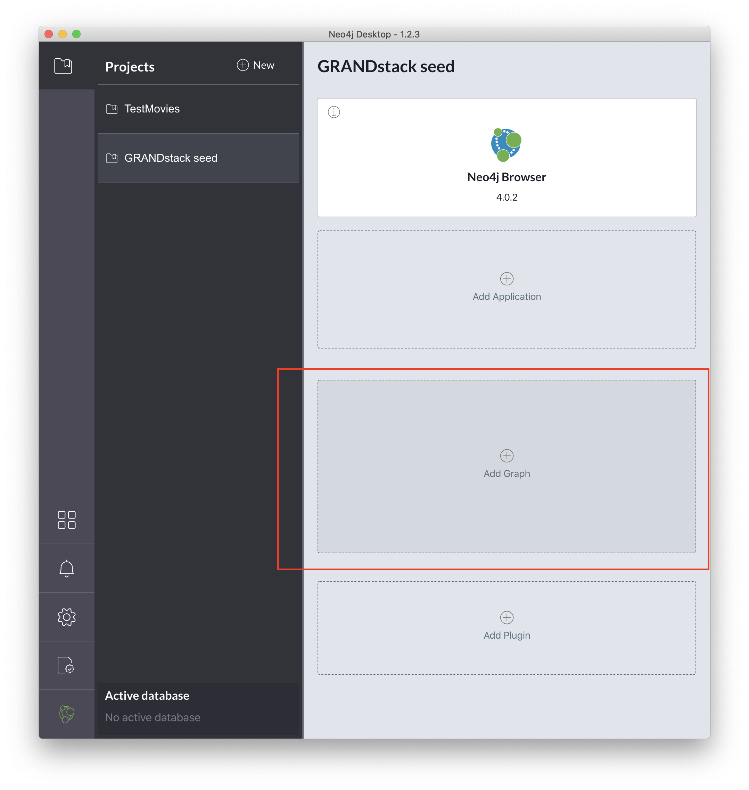
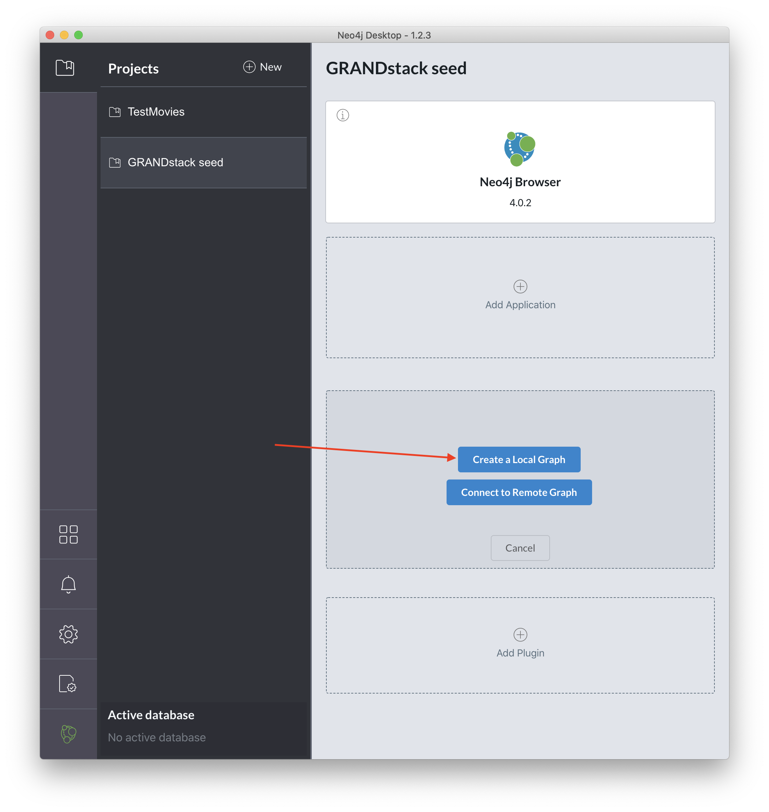
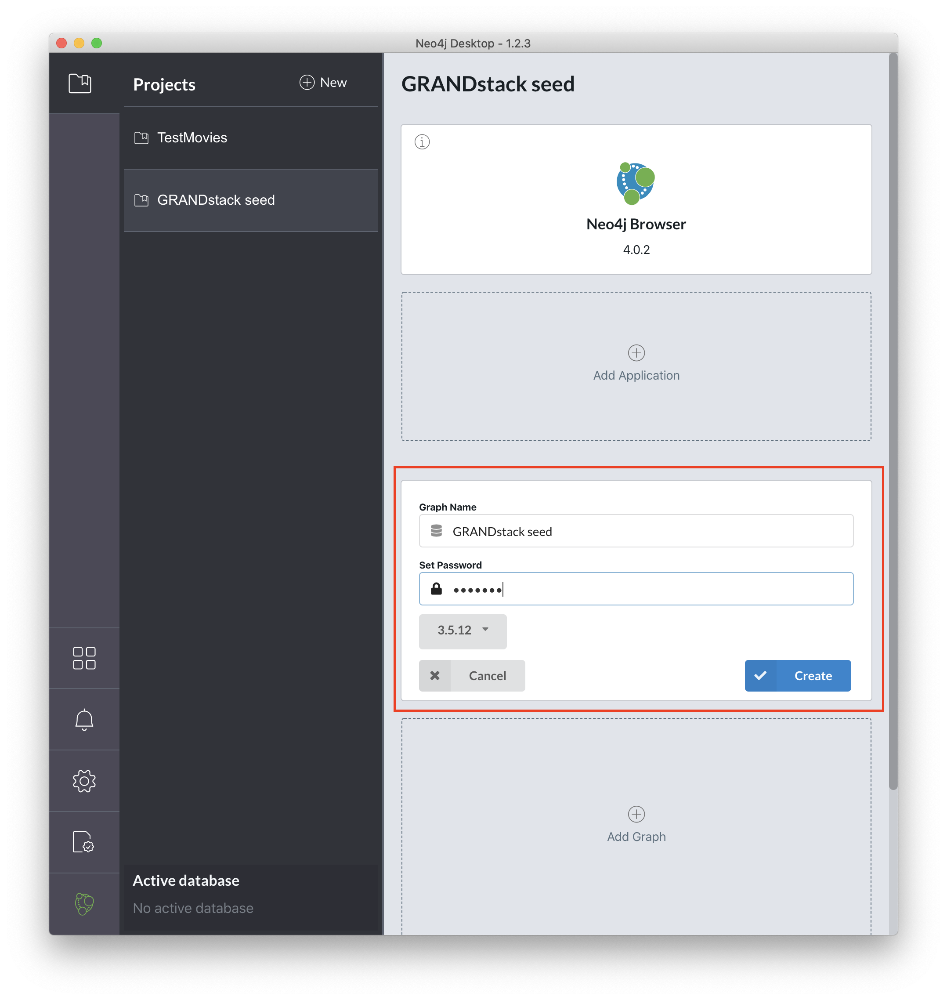
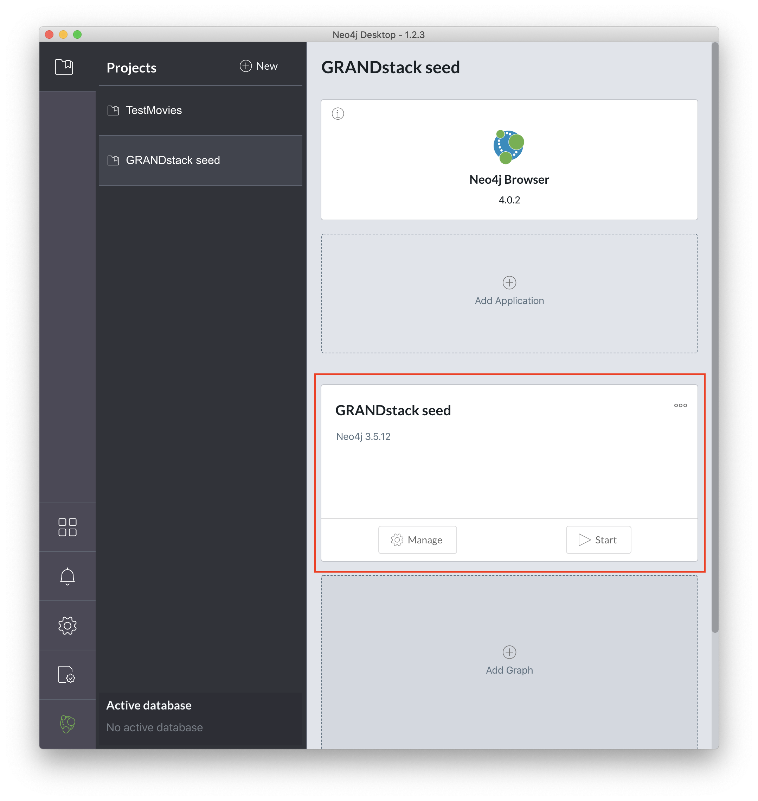
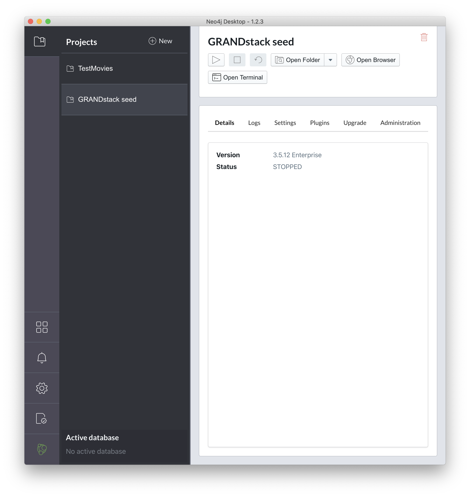
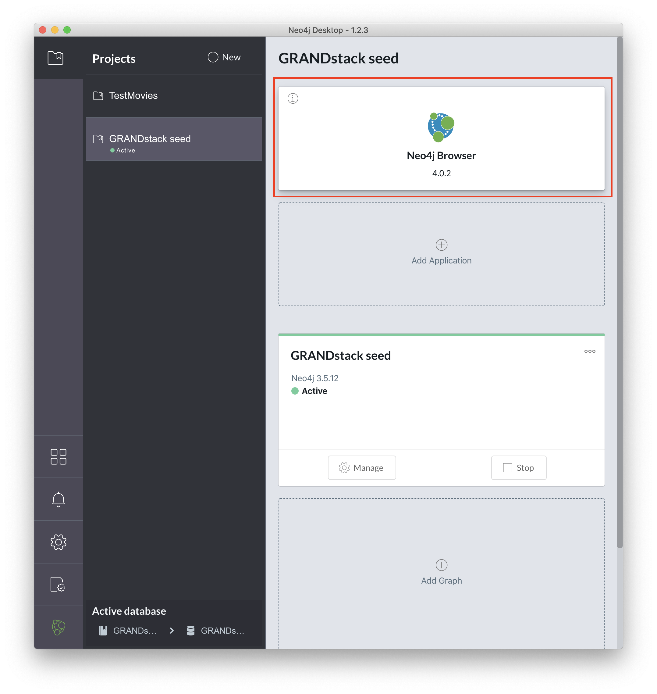
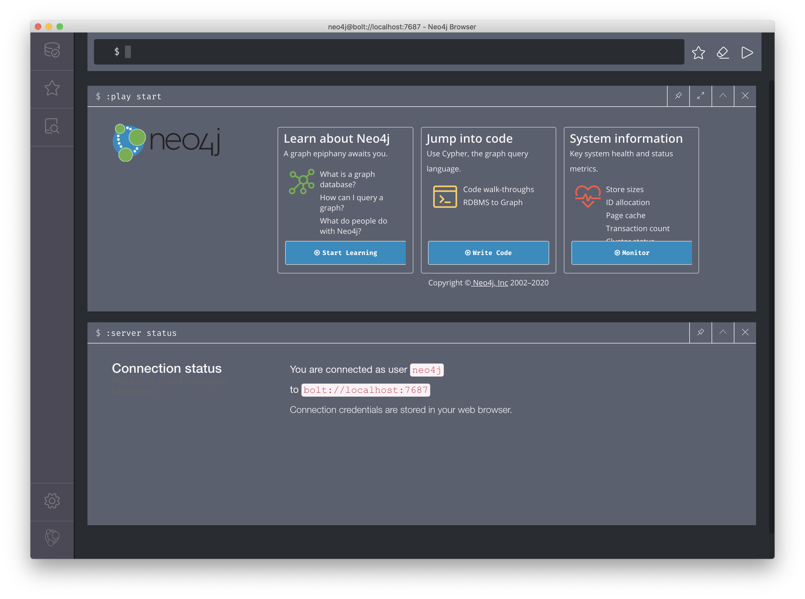

# GRANDstack seed

This project was originally inspired by existing work from [@erikrahm](https://github.com/erikrahm) in the repo [https://github.com/erikrahm/grand-stack-seed](https://github.com/erikrahm/grand-stack-seed)

GRANDStack ([GraphQL](https://graphql.org), [React](https://reactjs.org), [Apollo](https://www.apollographql.com), [Neo4j Database](https://neo4j.com)) seed project with built-in Local Auth and Facebook OAuth, and sample User GQL types/queries/mutations.

## Neo4j set-up and configuration

The easiest way to work with this project is to download and install the free [Neo4j Desktop](https://neo4j.com/product/#desktop) for your development environment.

Once you have installed the free [Neo4j Desktop](https://neo4j.com/product/#desktop), all you will need to do is:

+ Create a new project
+ Create a new graph database
+ Start the graph database
+ Launch the Neo4j browser

### Create a new project

After opening [Neo4j Desktop](https://neo4j.com/product/#desktop), you will need to create a new project:

Let's create a new project with the name `GRANDstack seed`:

### Create a new graph database

Once a project has been created, you will then need to create a new graph database:

For this demo, I will create a new graph database with the following settings:

+ `Graph Name` - `GRANDstack seed`
+ `Set Password` - `letmein`
+ Use the latest version of the Neo4j database - Version `3.5.12` in this example

...wait a minute. What about the username? By default, [Neo4j Database](https://neo4j.com) will associate this password we're defining with a `neo4j` user account.

Once we click create, we will see:

#### Take a peek: Manage the graph database

If you click on `Manage` you will see a screen similar to:

### Start the graph database

Assuming we have created our graph database, we will see something like:

We will need to explicitly start/stop our graph database if we wish to use it 🤓

### Launch the Neo4j browser

With the graph database started, we can finally fire up the Neo4j Browser - a tool we will use for querying, visualizing, and interacting with our data:

Please see [Neo4j Browser User Interface Guide](https://neo4j.com/developer/neo4j-browser/) for a great introductory video as well as a guide to working with this tool.

## Seed project set-up

For reference, I've created a sample `server/.env.sample` file that you can copy to `server/.env` and tweak as necessary.

1. Create `.env` file in your `./server` directory with the following env variables:

 `NEO4J_URI= *example: bolt://localhost:8687*` (this can be a local instance of neo4j or a neo4j sandbox URI)

 `NEO4J_USER= *example: neo4j*`

 `NEO4J_PASSWORD= *example: password*`

2. Create a JWT encryption key using a service such as [https://mkjwk.org/](https://mkjwk.org/) or [https://www.grc.com/passwords.htm](https://www.grc.com/passwords.htm). This will be used for encryption in your username/password auth strategy. Once you have the key add it to your `./server`'s `.env` file like so:

 `JWT_SECRET= *example: generated secret*`

3. Install dependencies in the root and for both the server and client by running `npm install` in the root directory, followed by `npm run install-all` in the root directory.

4. Start  both servers by running `npm start` in the root of the project`

5. Start dev-ing!

## Project configuration

### Enable Facebook OAuth

Facebook OAuth by default is disabled, to allow for users of this seed project without interest in OAuth to forego it altogether. If you would like to enable it all you have to do is create a new app at https://developers.facebook.com and then add the app credentials to the `.env` file in the `./server` directory.

 FB_ID= *Get this from https://developers.facebook.com*

 FB_SECRET= *Get this from https://developers.facebook.com*

If you plan to run this project locally (on localhost) then make sure to edit the Facebook App's settings and add `localhost` to the App Domains field and add `http://localhost:8000/` as the Site Url in the Website list at the bottom of the settings.

### Server configuration

1. There is a schema.graphql file that contains all of the app's type definitions and is run through a schema generator that converts Cypher queries (indicated by the `@cypher` or `@relationship` directives) into valid computed properties.
2. You can turn on automatic mutation generation on `line 44` of the `server/src/index.js` file and mutation on `line 45` (this will generate queries for all of your defined types, and add/update/delete mutations for all of your types as well) though I recommend writing your own resolvers or computed properties using the directives mentioned above as it will give you more fine-grained control over your application.
3. There is Local already built into the application, you can see this in action in the `server/src/resolvers.js` file. Facebook OAuth is also built-in and can be seen in the `server/src/index.js` file!
4. You can create even more complex queries and mutations by leverage in the `neo4jgraphql` method that is exposed by `neo4j-graphql-js` package by mutating data passed into a query/mutation before it hits your neo4j database, you can see this in `server/src/resolvers.js` on `lines 8-12` where passwords are being hashed and salted by `bcrypt`

### Client configuration

 1. This is just a basic Create React App (with typescript) that can be configured to your heart's content. (If you're unfamiliar with how to do this there are many resources available online.
 2. The app is wrapped in an `ApolloProvider` making your GraphQL server queriable throughout the app. (This happens in `client/src/components/App.tsx`
 3. The app is also wrapped in a `BrowserRouter` from `react-router` and you can define your routes as you see fit.

- There is an authenticated route at `/` that can only be accessed once a user is logged in.

- There is a `/register` route that has some default styled form fields that handle user registration and a `/login` route to authenticate a user.
